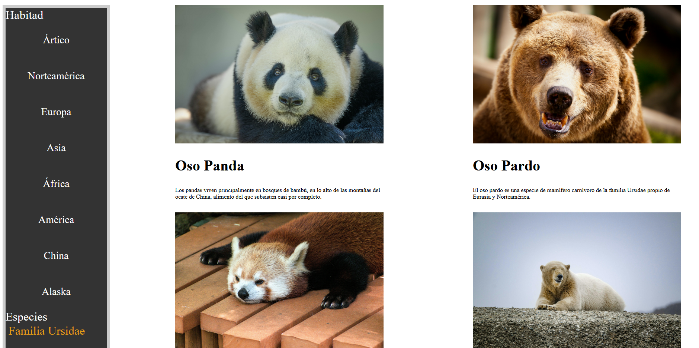
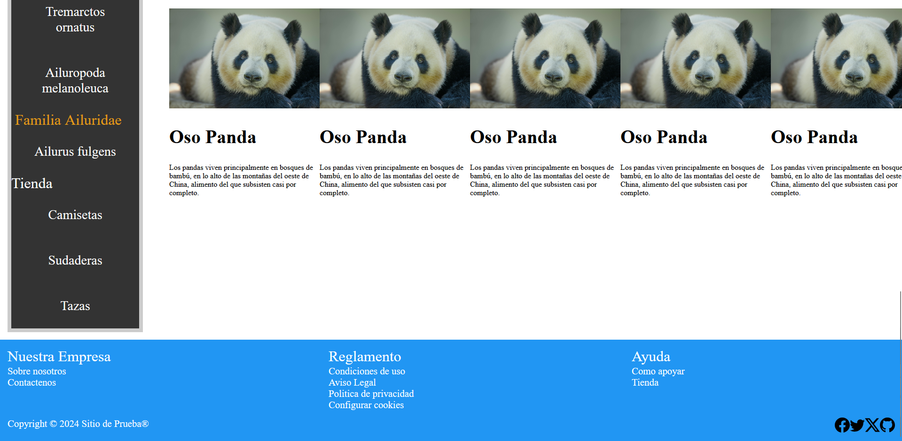
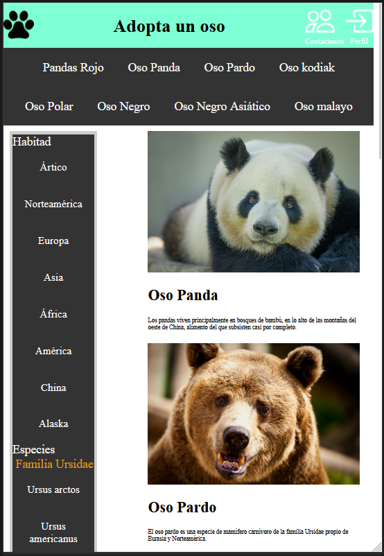
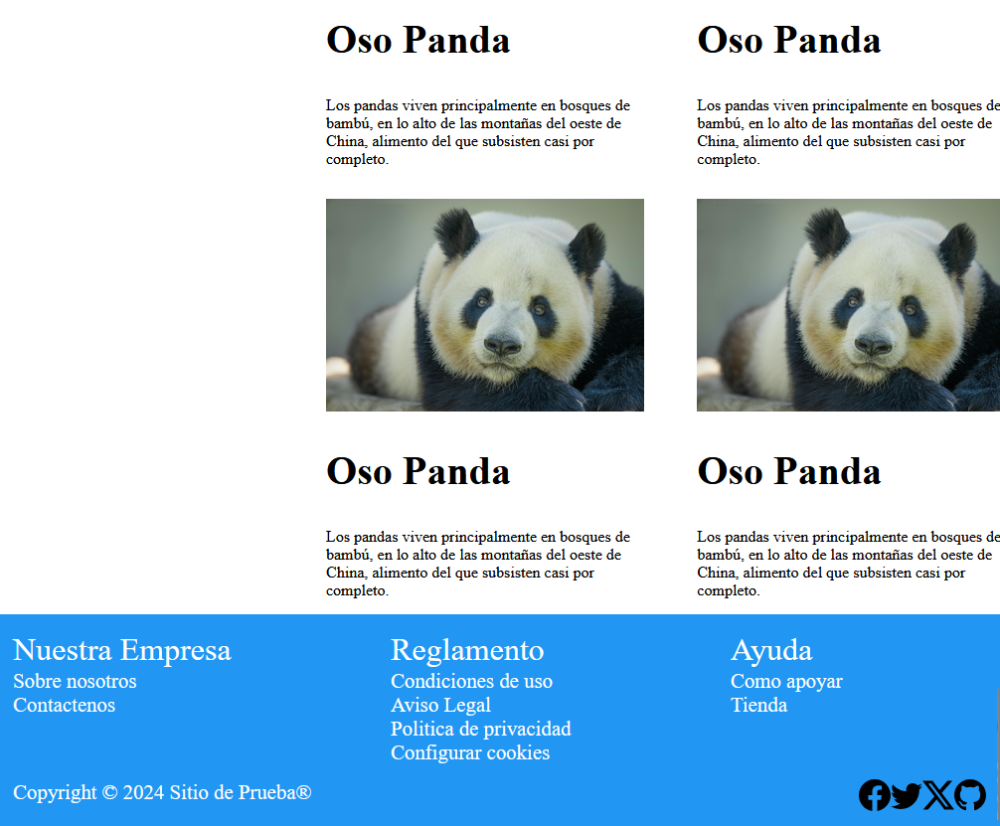

# AdoptaOso
## Descripción
Vamos a diseñar la página principal de un comercio. Esta página deberá tener claramente visibles los siguientes elementos:

* El encabezado de la página, donde se ubicarán el logotipo y el nombre de la empresa y los enlaces de contacto y de gestión del perfil del usuario.
        
* Una barra de navegación, que permitirá el acceso a las diferentes páginas del sitio web. Piensa en estas páginas como departamentos (ropa, electrónica, alimentación...) o servicios (catálogo, novedades, servicio postventa...).
        
* Una barra lateral. En la página de catálogo nos llevará a categorías específicas, pero en este caso, al tratarse de la página principal, nos llevará a las categorías más visitadas o que el negocio quiera promocionar.
        
* Un área principal, que contendrá al menos cuatro elementos de gran tamaño (pueden ser productos, servicios o anuncios) y, debajo, más elementos de menor tamaño.
        
* Un pie de página, que contendrá enlaces a contenido reglamentado (Condiciones de contratación, condiciones de uso web,aviso legal, política de privacidad, configurar cookies...), a contenido de ayuda (Cómo comprar, envíos, devoluciones, bases promocionales...) y a contenido corporativo (Quiénes somos, misión, visión y valores, responsabilidad social corporativa, tiendas...).

## Resultado
### Página resolución PC

### Página resolución móvil 

